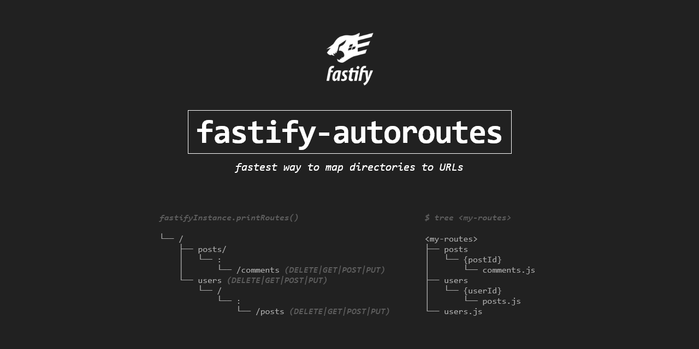

# fastify-autoroutes

<div align="center">



 &nbsp; 

[](https://www.npmjs.com/package/fastify-autoroutes)
[](https://www.npmjs.com/package/fastify-autoroutes)
[](https://snyk.io/test/github/GiovanniCardamone/fastify-autoroutes)
[](https://github.com/GiovanniCardamone/fastify-autoroutes/blob/master/LICENSE)


[](https://coveralls.io/github/GiovanniCardamone/fastify-autoroutes?branch=master)

</div>

> :star: Thanks to everyone who has starred the project, it means a lot!

Plugin to handle routes in fastify automatically based on directory structure.

## :newspaper: **[Full Documentation](https://giovannicardamone.github.io/fastify-autoroutes/)**

[fastify-autoroutes](https://giovannicardamone.github.io/fastify-autoroutes/)

## :rocket: Install

```sh
npm install --save fastify-autoroutes
```

## :blue_book: Usage

### Register plugin

```js
const fastify = require('fastify')
const server = fastify()

server.register(require('fastify-autoroutes'), {
  dir: './<autoroutes-directory>', // relative to your cwd
})
```

### Create file in autoroutes directory

```js
//file: `<autoroutes-directory>/some/route.js`
//url:  `http://your-host/some/route`

export default (fastifyInstance) => ({
  get: {
    handler: async (request, reply) => 'Hello, Route'
  },
})
```

### Using typescript support for module

```typescript
//file: `<autoroutes-directory>/some/route.ts`
//url:  `http://your-host/some/route`

import { FastifyInstance } from 'fastify'
import { Resource } from 'fastify-autoroutes'

export default (fastify: FastifyInstance) => <Resource> {
  get: {
    handler: async (request: FastifyRequest, reply: FastifyReply) => 'Hello, Route!'
  }
}
```

### Accepts params in autoroutes

> :information_source: file/directory name must follow syntax `:paramName` or `{paramName}`

```js
//file: `<autoroutes-directory>/users/{userId}/photos.js`
//mapped to: `<your host>/users/:userId/photos`

export default (fastifyInstance) => ({
  get: {
    handler: (request, reply) => {
      reply.send(`photos of user ${request.params.userId}`)
    }
  },
})
```

## :arrow_forward: Route module definition

Method specification for attributes is available here: [Method specification](https://www.fastify.io/docs/latest/Routes/#full-declaration)

> :information_source: attributes `url` and `method` are dynamically provided

Allowed attributes mapped to Http methods in module:

- delete
- get
- head
- patch
- post
- put
- options

## :arrow_forward: Skipping files

to skip file in routes directory, prepend the `.` or `_` character to filename

examples:

```text
routes
├── .ignored-directory
├── _ignored-directory
├── .ignored-js-file.js
├── _ignored-js-file.js
├── .ignored-ts-file.ts
├── _ignored-ts-file.ts
├── ignored-js-test.test.js
└── ignored-ts-test.test.ts
```
> :warning: also any `*.test.js` and `*.test.ts` are skipped!

this is useful if you want to have a lib file which contains functions that don't have to be a route, so just create the file with `_` prepending character

## :page_facing_up: License

Licensed under [MIT](./LICENSE)

## :sparkles: Contributors

Thanks goes to these wonderful people ([emoji key](https://allcontributors.org/docs/en/emoji-key)):

<!-- ALL-CONTRIBUTORS-LIST:START - Do not remove or modify this section -->
<!-- prettier-ignore-start -->
<!-- markdownlint-disable -->
<table>
  <tr>
    <td align="center"><a href="http://giovannicardamone.github.io"><br /><sub><b>Giovanni Cardamone</b></sub></a><br /><a href="https://github.com/GiovanniCardamone/fastify-autoroutes/commits?author=GiovanniCardamone" title="Code">💻</a> <a href="https://github.com/GiovanniCardamone/fastify-autoroutes/commits?author=GiovanniCardamone" title="Documentation">📖</a> <a href="#example-GiovanniCardamone" title="Examples">💡</a> <a href="#maintenance-GiovanniCardamone" title="Maintenance">🚧</a></td>
    <td align="center"><a href="https://github.com/genbs"><br /><sub><b>Gennaro</b></sub></a><br /><a href="#design-genbs" title="Design">🎨</a></td>
  </tr>
</table>

<!-- markdownlint-enable -->
<!-- prettier-ignore-end -->
<!-- ALL-CONTRIBUTORS-LIST:END -->

This project follows the [all-contributors](https://github.com/all-contributors/all-contributors) specification.

Contributions of any kind welcome!
